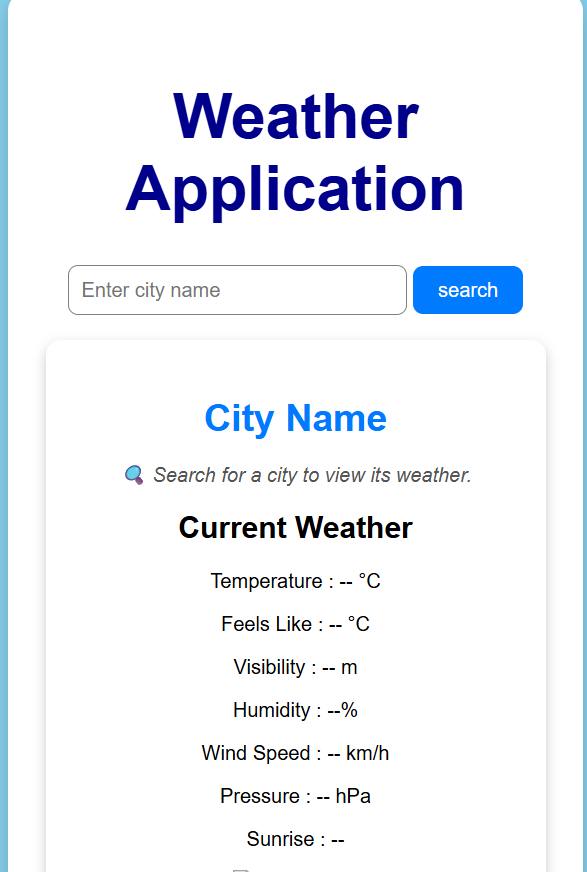

# Weather Application

## Project Description

This is a responsive Weather Application built using HTML, CSS, and JavaScript. It allows users to search for a city and view weather information in a clean, user-friendly interface.

---

## Features

- Search weather by city
- Responsive design
- Clean user interface
- Fast and simple

---

## Technologies Used

- HTML5
- CSS3
- JavaScript

---

## Project Structure

Weather-Application/
│── index.html
│── style.css
│── script.js
│── images/
│── README.md

---

## Screenshots

### Home Page

### Search Result

---

## How to Run

1. Download the project.
2. Open the project folder.
3. Open `index.html` in a web browser.

---

## Author

Nyasa Yadav
